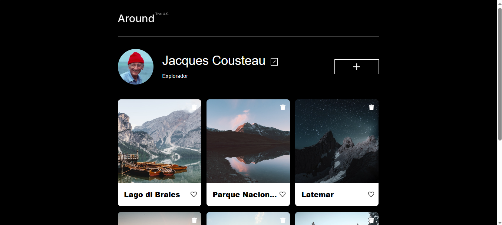

# Tripleten - Around The U.S.

O **Around The U.S.** é uma página interativa onde os usuários podem adicionar, remover e curtir fotos de locais dos Estados Unidos e também podem editar informações pessoais do perfil.

## 🚀 Funcionalidades

- **Perfil do usuário:** Adicione informações pessoais como nome e uma breve descrição sobre você.
- **Galeria de fotos:** Veja, adicione ou remova fotos de paisagens de lugares.
- **Interatividade:** Curta fotos da galeria.

## 🛠️ Tecnologias e Técnicas Usadas

- **HTML:** Estrutura do site.
- **CSS:** Estilização e design da página.
- **JavaScript:** Funcionalidade de interação com o usuário (abrir/fechar popups, editar perfil, adicionar e remover imagens).
- **Responsividade:** O design foi feito para ser responsivo, adaptando-se a diferentes tamanhos de tela, com no mínimo 320px de largura.
- **Programação Orientada a Objetos**: Uso de classes para organizar o código JavaScript.

## 📸 Demonstração do projeto

## 🌐 Acesse o site:

https://lorinogueira.github.io/web_project_around/

## 👩‍💻 Autor

Desenvolvido por [Lorena Nogueira](https://github.com/lorinogueira).  
Conecte-se comigo no [LinkedIn](https://www.linkedin.com/in/lorenamendes0/).
